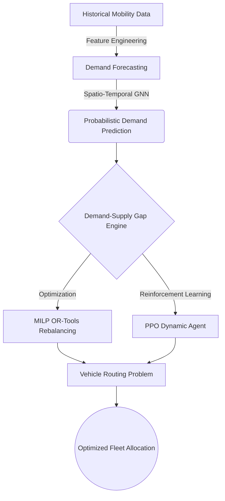

<div align="center">
  <h1>🚀 MobilityGraph-RL</h1>
  <p><b>Urban Mobility Demand Forecasting & Dynamic Vehicle Rebalancing</b></p>
  
  
  
  
  
  
  
</div>

---

## 🌍 The Challenge: Urban Mobility Fleet Imbalance
Shared mobility operators (like Yulu, Lime, and Bird) face a critical operational challenge: **vehicles naturally accumulate in low-demand areas while high-demand areas run empty.**

If an operator fails to predict demand and reposition vehicles *before* demand arrives, they suffer:
- ❌ **Lost Revenue:** Unmet demand due to vehicle shortages.
- ❌ **Inefficient Capital:** Idle vehicles sitting in surplus zones.
- ❌ **High Operational Costs:** Haphazard and reactive vehicle relocation.

## 💡 The Solution: MobilityGraph-RL
**MobilityGraph-RL** is an end-to-end Machine Learning and Operations Research architecture designed to solve the fleet rebalancing problem. It leverages **Spatio-Temporal Graph Neural Networks (ST-GNNs)** to predict demand, and uses a combination of **Operations Research (MILP)** and **Reinforcement Learning (PPO)** to dynamically route and rebalance the fleet.

### 🏗️ Architecture Pipeline



---

## 🌟 Core Components

### 1️⃣ Simulation & Data Engineering
- **Deterministic Mobility Simulator**: Generates realistic spatial demand incorporating diurnal cycles, weekend effects, and weather conditions (temperature/precipitation). 
- **Preprocessing**: Robust cleaning, scaling, and strict chronological train/val/test splitting to prevent data leakage.
- **Feature Engineering**: Creates time-lag features, rolling statistics, and temporal indicators.

> [!NOTE]
> **Data Simulation Setup:** The core demand and fleet states in this repo are simulated using realistic geographic dynamics. This guarantees deterministic reproducibility while maintaining structural fidelity for the ML models, as the original dataset lacked complete vehicle telematics.

### 2️⃣ Graph Construction (Graph ML)
- Constructs a spatial graph of mobility zones using **K-Nearest Neighbors (KNN)** and geospatial distance thresholds.
- Represents spatial connectivity as Adjacency Matrices and PyTorch Geometric `edge_index`.

### 3️⃣ Demand Forecasting & Anomaly Detection
- **ST-GNN**: A Spatio-Temporal Graph Convolutional Network combining `GCNConv` layers for spatial dependencies and `LSTM` layers for temporal dynamics. 
- **Uncertainty Estimation**: Uses Monte Carlo Dropout to generate Probabilistic Forecasts (e.g., $95\%$ Confidence Intervals).
- **Baselines**: Includes Naive, Moving Average, and XGBoost predictors for comparative evaluation.
- **Anomaly Detection**: `IsolationForest` and Z-Score methods applied to forecasting residuals to detect abnormal demand spikes.

### 4️⃣ Fleet Rebalancing Optimization (MILP)
Uses **Google OR-Tools** to solve a Mixed Integer Linear Program (MILP). It calculates the optimal vehicle relocations to minimize cost while strictly adhering to capacity and travel distance constraints.

### 5️⃣ Dynamic Reinforcement Learning (PPO)
- **Custom Gymnasium Environment**: Formulates fleet rebalancing as a Markov Decision Process (MDP).
- **Agent**: Trains a Proximal Policy Optimization (PPO) agent using `stable-baselines3` to make sequential fleet repositioning decisions.

---

## 🧮 Mathematical Formulation

### 📐 Operations Research (MILP)
Let:
- $x_{ij}$ = number of vehicles moved from zone $i$ to zone $j$
- $D_i$ = predicted demand in zone $i$
- $S_i$ = available supply in zone $i$
- $d_{ij}$ = distance between $i$ and $j$

**Objective Function**:
$$ \min \sum_{i,j} (0.5 \cdot d_{ij} \cdot x_{ij}) + 10 \cdot \sum_i \text{unmet}_i + 1 \cdot \sum_i \text{idle}_i $$

**Subject to Constraints**:
$$ \sum_j x_{ij} \le S_i \quad \text{(Cannot move more than supply)} $$
$$ \text{final\_supply}_j = S_j - \sum_k x_{jk} + \sum_i x_{ij} $$
$$ \text{unmet}_j \ge D_j - \text{final\_supply}_j $$

### 🤖 Reinforcement Learning (MDP)
- **State ($S$)**: Vector containing current demand, current supply per zone, and time of day.
- **Action ($A$)**: Matrix of continuous values $[-1, 1]$ mapping to the percentage of vehicles to relocate between zones.
- **Reward ($R$)**: $-(10 \cdot \text{Total Unmet Demand} + 0.5 \cdot \text{Total Relocation Distance})$
- **Transition ($P$)**: Natural supply fluctuation combined with the agent's relocations.

---

## 📂 Project Structure

```text
mobility-intelligence/
├── api/                   # FastAPI application serving ML predictions
├── dashboard/             # Streamlit dashboard for fleet monitoring
├── data/                  # Raw and processed mobility data
├── src/
│   ├── anomaly_detection/ # Z-Score & Isolation Forest
│   ├── data_pipeline/     # Simulator and Preprocessor
│   ├── evaluation/        # Strategy comparison and ablations
│   ├── feature_engineering/# Lag and rolling features
│   ├── forecasting/       # ST-GNN and XGBoost models
│   ├── geospatial/        # Folium heatmaps and routing visualizers
│   ├── graph_ml/          # Distance and KNN graph builders
│   ├── monitoring/        # Concept drift and MAE tracking
│   ├── optimization/      # Imbalance engine and MILP OR-Tools
│   ├── reinforcement_learning/ # Gymnasium Env & PPO Training
│   └── routing/           # VRP solver for fleet routes
├── tests/                 # Pytest unit tests
├── Dockerfile             # Containerization config
└── requirements.txt       # Python dependencies
```

---

## 🚀 Reproducibility and Execution

### 1. Requirements & Setup
Install the necessary dependencies in your Python 3.11+ environment:
```bash
pip install -r requirements.txt
```
Alternatively, build the Docker container:
```bash
docker build -t mobility-graph-rl .
```

### 2. Running the Core Pipeline
Run the complete pipeline sequentially from the project root:

```bash
# Generate deterministic data
python -m src.data_pipeline.simulator

# Build the spatial graph
python -m src.graph_ml.graph_builder

# Run Unit Tests
pytest tests/

# Train RL Agent (Optional)
python -m src.reinforcement_learning.train_rl
```

### 3. Running Production Services
Start the **FastAPI Backend**:
```bash
uvicorn api.main:app --reload --port 8000
```
Start the **Streamlit Dashboard** (in a new terminal):
```bash
streamlit run dashboard/app.py
```

---

## 🔮 Future Improvements
- **Real Telemetry Data**: Integrate actual origin-destination trips and real-time battery levels from operators.
- **Advanced Uncertainty Calibration**: Move beyond MC Dropout to Deep Ensembles or Quantile Regression for sharper confidence bounds.
- **Dynamic Charging Constraints**: Extend the Vehicle Routing Problem to include battery charging requirements for electric fleets.
